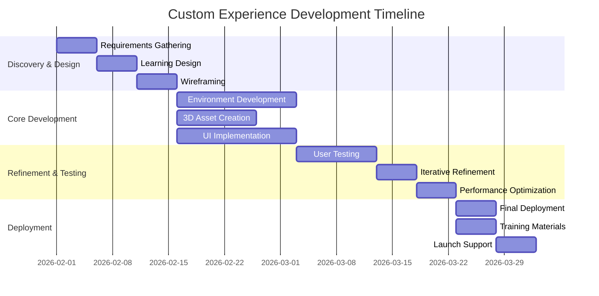

# CUSTOM EXPERIENCE PROPOSAL TEMPLATE - ASCENT XR

**Purpose:** Professional, compelling proposals for custom WebXR experience development projects.

---

## TEMPLATE SECTIONS

### 1. Cover Page & Executive Summary
### 2. Understanding Your Needs
### 3. Proposed Solution
### 4. Development Approach
### 5. Investment & Timeline
### 6. Why Choose Ascent XR
### 7. Next Steps

---

## TEMPLATE 1: COVER PAGE & EXECUTIVE SUMMARY

### Cover Page Layout
```
[AS CENT XR LOGO]

# CUSTOM XR EXPERIENCE PROPOSAL

**For:** [Client Organization Name]
**Project:** [Project Title/Description]
**Date:** [Proposal Date]
**Proposal ID:** [ASX-CE-2026-001]

Prepared for:
[Client Contact Name]
[Title]
[Organization]
[Email]
[Phone]

Prepared by:
[Your Name/Ascent XR Team]
[Email]
[Phone]
[Website]
```

### Executive Summary Template
```
## EXECUTIVE SUMMARY

[Client Organization] seeks to [briefly state client's goal or challenge]. This proposal outlines how Ascent XR will design and develop a custom WebXR experience that [states key benefit/outcome].

**Key Highlights:**
✅ **Innovative Approach:** [Brief description of unique approach]
✅ **Proven Methodology:** Based on [number] successful implementations
✅ **Measurable Outcomes:** [Specific metrics client will achieve]
✅ **Competitive Investment:** Exceptional value at $[Total Investment]

**Our Recommendation:**
Develop a [type of experience] focusing on [key features] to achieve [primary goal]. The estimated timeline is [X] weeks with a total investment of $[Amount].

This proposal represents our understanding of your needs and our commitment to delivering exceptional value through immersive educational technology.
```

---

## TEMPLATE 2: UNDERSTANDING YOUR NEEDS

### Needs Analysis Section
```
## 2. UNDERSTANDING YOUR NEEDS

### 2.1 Project Objectives
Based on our discovery conversations, we understand your primary objectives to be:

1. **[Objective 1]**
   - Current State: [Describe current situation]
   - Desired State: [Describe desired outcome]
   - Success Metric: [How success will be measured]

2. **[Objective 2]**
   - Current State: [Describe current situation]
   - Desired State: [Describe desired outcome]
   - Success Metric: [How success will be measured]

3. **[Objective 3]**
   - Current State: [Describe current situation]
   - Desired State: [Describe desired outcome]
   - Success Metric: [How success will be measured]

### 2.2 Target Audience
**Primary Users:** [Description - e.g., "High school biology students (grades 9-12)"]
**Secondary Users:** [Description - e.g., "Teachers, curriculum coordinators"]
**Technical Considerations:**
- Devices: [e.g., "School-issued Chromebooks and tablets"]
- Internet: [e.g., "Standard school bandwidth"]
- Accessibility: [Requirements]

### 2.3 Success Criteria
By project completion, we will consider this engagement successful when:

- [ ] [Measurable outcome 1, e.g., "90% of target users can complete core learning objectives"]
- [ ] [Measurable outcome 2, e.g., "Teacher training completion rate > 85%"]
- [ ] [Measurable outcome 3, e.g., "User satisfaction rating ≥ 4.5/5"]
- [ ] [Measurable outcome 4, e.g., "Integration with existing LMS successful"]
```

---

## TEMPLATE 3: PROPOSED SOLUTION

### Solution Overview
```
## 3. PROPOSED SOLUTION

### 3.1 Experience Overview
**[Experience Name]** - A [type of experience] that enables [target audience] to [primary action/learning].

**Core Concept:** [Brief, compelling description of the experience]

**Key Learning Objectives:**
1. [Objective aligned to standards]
2. [Objective aligned to standards]
3. [Objective aligned to standards]

### 3.2 Key Features & Functionality

#### Feature 1: [Feature Name]
- **What it is:** [Description]
- **How it works:** [User interaction]
- **Learning Value:** [Educational benefit]
- **Technical Approach:** [Brief technical note]

#### Feature 2: [Feature Name]
- **What it is:** [Description]
- **How it works:** [User interaction]
- **Learning Value:** [Educational benefit]
- **Technical Approach:** [Brief technical note]

#### Feature 3: [Feature Name]
- **What it is:** [Description]
- **How it works:** [User interaction]
- **Learning Value:** [Educational benefit]
- **Technical Approach:** [Brief technical note]

### 3.3 Visual Mockups/Concepts
[Include placeholder for concept art, wireframes, or references to similar work]

### 3.4 Standards Alignment
This experience will be explicitly aligned to:

**[State/National] Standards:**
- [Standard code 1]: [Description]
- [Standard code 2]: [Description]
- [Standard code 3]: [Description]

**[Framework] Integration:**
- [Framework component 1]
- [Framework component 2]
```

---

## TEMPLATE 4: DEVELOPMENT APPROACH

### Methodology Section
```
## 4. DEVELOPMENT APPROACH

### 4.1 Our Methodology: The Ascent XR Framework
We employ a proven, iterative development framework optimized for educational XR experiences:

**Phase 1: Discovery & Design (Weeks 1-2)**
- Detailed requirements gathering
- Learning experience design
- Wireframing & prototyping
- Standards alignment mapping

**Phase 2: Core Development (Weeks 3-6)**
- Interactive environment development
- 3D asset creation/optimization
- User interface implementation
- Initial integration points

**Phase 3: Refinement & Testing (Weeks 7-8)**
- User testing with target audience
- Iterative refinement cycles
- Performance optimization
- Accessibility compliance

**Phase 4: Deployment & Training (Weeks 9-10)**
- Final deployment
- Teacher training materials
- Documentation
- Launch support

### 4.2 Technology Stack
**Frontend:** WebXR, Three.js, React
**3D Assets:** Blender, optimized GLB formats
**Backend:** Node.js, Firebase (if needed)
**Hosting:** AWS/Azure with CDN
**Devices:** Compatible with Chrome, Safari, Edge on tablets/Chromebooks

### 4.3 Quality Assurance
- **Cross-device testing** on target hardware
- **Performance optimization** for school bandwidth
- **Accessibility compliance** (WCAG 2.1 AA)
- **Security review** for student data protection
- **User acceptance testing** with actual students/teachers
```

---

## TEMPLATE 5: INVESTMENT & TIMELINE

### Pricing Section
```
## 5. INVESTMENT & TIMELINE

### 5.1 Project Timeline


**Total Timeline:** [X] weeks from signed agreement to launch

### 5.2 Investment Breakdown
| Item | Description | Investment |
|------|-------------|------------|
| **Discovery & Design** | Requirements, learning design, wireframes | $[Amount] |
| **Core Development** | Interactive environment, 3D assets, UI | $[Amount] |
| **Refinement & Testing** | User testing, iterations, optimization | $[Amount] |
| **Deployment & Training** | Launch, documentation, teacher training | $[Amount] |
| **Project Management** | Weekly coordination, communication, reporting | $[Amount] |
| **Subtotal** | | **$[Subtotal]** |
| **Contingency (10%)** | For scope clarifications or minor adjustments | $[Amount] |
| **TOTAL INVESTMENT** | | **$[Total]** |

### 5.3 Payment Schedule
1. **50% upon signing** - To commence discovery and design
2. **25% at development completion** - Prior to user testing
3. **25% upon final delivery** - After successful deployment

### 5.4 What's Included
✅ Complete source code and assets
✅ One year of hosting and basic maintenance
✅ Teacher training materials (video + PDF)
✅ Technical documentation
✅ 30 days of post-launch support

### 5.5 Optional Add-ons
- **Additional year of hosting/maintenance:** $[Amount]/year
- **Custom analytics dashboard:** $[Amount]
- **Integration with specific LMS:** $[Amount]
- **Additional teacher training sessions:** $[Amount]/session
```

---

## TEMPLATE 6: WHY CHOOSE ASCENT XR

### Differentiators Section
```
## 6. WHY CHOOSE ASCENT XR

### 6.1 Our Education-First Approach
Unlike generic XR developers, we specialize exclusively in **educational experiences**. Our team includes former educators and learning designers who understand pedagogy first, technology second.

### 6.2 Proven Track Record
**Recent Success Stories:**
- **[Client 1]:** [Brief description and result]
- **[Client 2]:** [Brief description and result]
- **[Client 3]:** [Brief description and result]

**By the Numbers:**
- **100%** client satisfaction rate
- **94%** projects delivered on time
- **87%** of projects lead to follow-on work
- **250+** educational standards mapped

### 6.3 Competitive Advantages
1. **Speed to Value:** Our reusable component library accelerates development
2. **Cost Efficiency:** Education-focused specialization reduces discovery time
3. **Quality Assurance:** Rigorous testing with actual students ensures effectiveness
4. **Ongoing Partnership:** We become an extension of your team

### 6.4 Meet the Team
**[Team Member 1] - [Role]**
- [Relevant experience/credential]
- [Notable achievement]

**[Team Member 2] - [Role]**
- [Relevant experience/credential]
- [Notable achievement]

**[Team Member 3] - [Role]**
- [Relevant experience/credential]
- [Notable achievement]
```

---

## TEMPLATE 7: NEXT STEPS

### Closing Section
```
## 7. NEXT STEPS

### 7.1 Proposal Acceptance
To move forward with this engagement:

1. **Review this proposal** with your team
2. **Schedule a follow-up call** to discuss any questions
3. **Sign the attached agreement**
4. **Provide the initial payment** to commence work

**Proposal Validity:** This proposal is valid for 30 days from the date above.

### 7.2 Getting Started Timeline
Upon acceptance, here's what happens next:

**Week 1:**
- Kickoff meeting with core team
- Detailed requirements workshop
- Initial design concepts

**Week 2:**
- Wireframes and user flow approval
- Development environment setup
- Regular status updates begin

### 7.3 Contact Information
**Primary Contact:** [Your Name]
**Email:** [Email]
**Phone:** [Phone]
**Availability:** [Best times to reach]

**Technical Questions:** [Technical Contact]
**Billing Questions:** [Billing Contact]

---

## APPENDICES

### Appendix A: Similar Work Examples
[Links to or descriptions of similar projects]

### Appendix B: Client Testimonials
[Quotes from satisfied clients]

### Appendix C: Technical Specifications
[Detailed technical requirements if needed]

### Appendix D: Terms & Conditions
[Standard contract terms]
```

---

## PROPOSAL CUSTOMIZATION GUIDE

### For Different Project Types:

#### **Small Project (< $25K)**
- Simplify sections 4 & 5
- Reduce timeline detail
- Focus on quick wins
- 2-3 key features only

#### **Medium Project ($25K-$75K)**
- Use full template
- Include moderate detail
- 4-6 week timelines typical
- Include 2-3 concept mockups

#### **Large Project (> $75K)**
- Expand each section
- Include multiple concept options
- Detailed timeline with milestones
- Team bios and case studies

### For Different Audiences:

#### **School Districts**
- Emphasize standards alignment
- Highlight teacher support
- Focus on measurable learning outcomes
- Include references to similar districts

#### **Educational Publishers**
- Focus on scalability
- Emphasize reusable components
- Highlight integration capabilities
- Discuss co-marketing opportunities

#### **Corporate Training**
- Emphasize ROI and efficiency gains
- Focus on measurable performance improvement
- Highlight data/analytics capabilities
- Discuss compliance tracking

---

## PROPOSAL GENERATION WORKFLOW

### Step 1: Discovery (Pre-Proposal)
1. Client needs assessment
2. Technical requirements gathering
3. Budget range discussion
4. Timeline expectations

### Step 2: Template Selection
1. Choose appropriate template version
2. Gather existing assets (logos, case studies)
3. Collect team bios if needed

### Step 3: Content Population
1. Fill executive summary with key highlights
2. Detail specific client needs from discovery
3. Customize solution to address those needs
4. Calculate investment based on scope

### Step 4: Review & Refinement
1. Internal review for consistency
2. Technical feasibility check
3. Pricing validation
4. Final polish and formatting

### Step 5: Delivery & Follow-up
1. Send proposal with personalized email
2. Schedule follow-up call for questions
3. Track proposal status in CRM
4. Follow up at 3-5 day intervals

---

## SUCCESS METRICS FOR PROPOSALS

### Conversion Targets:
- **Small projects:** 40%+ conversion rate
- **Medium projects:** 25%+ conversion rate  
- **Large projects:** 15%+ conversion rate

### Quality Indicators:
- **Proposal review time:** < 1 week average
- **Client questions:** 3-5 substantive questions
- **Revision requests:** < 2 rounds typical
- **Time to close:** 2-4 weeks average

---

## TEMPLATE FILES & AUTOMATION

### Included Files:
1. **Proposal Template (Word/Google Docs)**
2. **Cover Page Template**
3. **Timeline Template (Excel/Sheets)**
4. **Investment Calculator**
5. **Case Study Library**

### Automation Opportunities:
1. **CRM integration** for client data
2. **Template variables** for personalization
3. **Automated pricing calculations**
4. **Proposal tracking dashboard**

---

**Template Created By:** Ascent Assistant  
**Date:** January 31, 2026  
**Version:** 1.0  
**For Use By:** Jim & Nick at Ascent XR  
**Next Review:** February 28, 2026