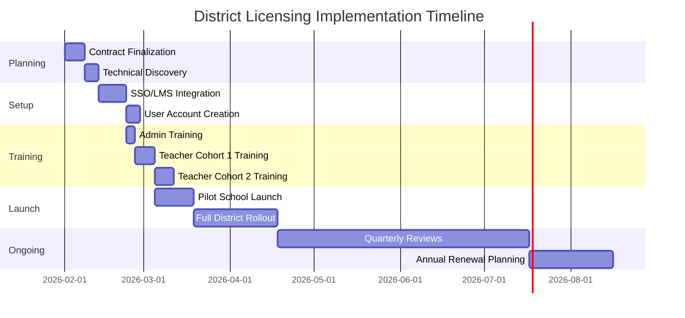

# DISTRICT LICENSING PROPOSAL TEMPLATE

## Template ID: ASX-DL-001
## Category: School District Adoption
## Use Case: District-wide license for multiple schools
## Complexity: High (Strategic, multi-year contracts)
## Average Deal Size: $50K - $500K+

---

## COVER PAGE

**AS CENT XR**

# DISTRICT LICENSING PROPOSAL

**For:** [School District Name]
**Proposal Type:** District-Wide License Agreement
**Student Population:** [Number] students
**School Count:** [Number] schools
**Term:** [1-5] years
**Date:** [Current Date]
**Proposal ID:** ASX-DL-[YYYY]-[NNN]

**Prepared for:**
[Superintendent Name], Superintendent
[District Name]
[Email]
[Phone]

**Prepared by:**
[Your Name], [Your Title]
Ascent XR
[Email]
[Phone]
[Website]

---

## EXECUTIVE SUMMARY

[District Name] seeks to enhance educational outcomes through immersive technology. This proposal outlines a comprehensive district-wide licensing agreement for Ascent XR's educational WebXR platform, providing [number] students and [number] teachers across [number] schools with access to cutting-edge virtual learning experiences.

**Key Value Proposition:**
✅ **Scalable Access:** One license covers entire district
✅ **Standards-Aligned:** Meets [State] educational standards
✅ **Teacher Support:** Comprehensive professional development
✅ **Data-Driven:** Real-time analytics on student engagement
✅ **Cost-Effective:** Significant savings over per-school pricing

**Recommended Package:** [Package Name] Tier
- **Students Covered:** All [number] students
- **Teachers Covered:** All [number] teachers
- **Platform Features:** [List key features]
- **Support Level:** [Support tier description]
- **Annual Investment:** $[Amount]/year
- **Term:** [X] years with [X]% renewal discount

---

## DISTRICT NEEDS ASSESSMENT

### 2.1 Strategic Goals Alignment
Based on our discovery conversations, [District Name]'s strategic objectives include:

1. **Digital Transformation Initiative:**
   - Current: [Describe current technology infrastructure]
   - Goal: Integrate immersive technology across curriculum
   - Metric: % of classrooms using digital learning tools

2. **Student Engagement & Achievement:**
   - Current: [Describe current engagement metrics]
   - Goal: Increase student engagement and test scores
   - Metric: Standardized test score improvement

3. **Teacher Development:**
   - Current: [Describe current PD offerings]
   - Goal: Provide cutting-edge technology training
   - Metric: Teacher satisfaction with PD resources

4. **Equity & Access:**
   - Current: [Describe current equity gaps]
   - Goal: Ensure all students have access to advanced learning tools
   - Metric: Usage across demographic groups

### 2.2 Technical Infrastructure
- **Current Devices:** [e.g., "15,000 Chromebooks, 500 iPads"]
- **Network:** [e.g., "District-wide fiber, 1Gbps internet"]
- **LMS:** [e.g., "Canvas, Google Classroom, Schoology"]
- **SIS:** [e.g., "PowerSchool, Infinite Campus"]
- **Single Sign-On:** [e.g., "Clever, ClassLink"]

### 2.3 Implementation Timeline Requirements
- **Pilot Phase:** [Start date] - [End date]
- **Full Rollout:** [Start date] - [End date]
- **Professional Development:** [Timeline requirements]
- **Reporting Periods:** Aligned with district assessment cycles

---

## PROPOSED SOLUTION

### 3.1 District License Overview
The Ascent XR District License provides unlimited access to our platform for all students and teachers within [District Name], including:

**Platform Access:**
- Unlimited student accounts
- Unlimited teacher/admin accounts
- Access to all current and future standard experiences
- District-level admin dashboard
- Single sign-on integration

**Professional Development:**
- [X] hours of live virtual training
- On-demand training library access
- Quarterly "Office Hours" sessions
- Teacher community forum access

**Support & Success:**
- Dedicated district success manager
- Priority technical support
- Monthly usage reports
- Quarterly strategy reviews

### 3.2 Included Experiences
Our platform includes [number] standards-aligned experiences:

**Core Subject Areas:**
- **Science:** [List experiences - e.g., "Virtual Cell Biology Lab", "Solar System Exploration"]
- **Math:** [List experiences - e.g., "3D Geometry Explorer", "Algebra Visualizer"]
- **Social Studies:** [List experiences - e.g., "Ancient Civilizations Tour", "Government Simulation"]
- **ELA:** [List experiences - e.g., "Interactive Storytelling", "Poetry Visualization"]

**Special Features:**
- **Assessment Tools:** Built-in quizzes and progress tracking
- **Differentiation:** Adaptive difficulty levels
- **Accessibility:** Screen reader support, alternative controls
- **Multi-language:** Support for [languages]

### 3.3 Integration & Implementation

**Technical Integration:**
1. **SSO Setup:** Integration with [District SSO solution]
2. **LMS Integration:** Gradebook sync with [District LMS]
3. **Roster Sync:** Automated student/teacher rostering
4. **Data Security:** FERPA/COPPA compliance

**Implementation Support:**
- **Phase 1:** Technical setup and configuration (2 weeks)
- **Phase 2:** Teacher training and onboarding (4 weeks)
- **Phase 3:** Classroom implementation support (8 weeks)
- **Phase 4:** Ongoing optimization and expansion

---

## PRICING & INVESTMENT

### 4.1 License Tiers

| Tier | Students | Schools | Features | Annual Price | 3-Year Discount |
|------|----------|---------|----------|---------------|------------------|
| **Bronze** | Up to 2,500 | Up to 5 | Basic experiences, standard support | $[Amount] | 10% |
| **Silver** | Up to 10,000 | Up to 15 | All experiences, enhanced support | $[Amount] | 15% |
| **Gold** | Up to 25,000 | Up to 30 | Premium experiences, priority support | $[Amount] | 20% |
| **Platinum** | Unlimited | Unlimited | All features, dedicated success manager | Custom | 25% |

### 4.2 Recommended Package
Based on [District Name]'s [number] students and [number] schools:

**Recommended:** [Gold] Tier
- **Annual License Fee:** $[Amount]
- **Multi-Year Discount (3 years):** 20%
- **Effective Annual Rate:** $[Amount]
- **Total 3-Year Investment:** $[Amount]

**Alternative Options:**
- **2-Year Agreement:** 15% discount
- **1-Year Agreement:** Standard pricing
- **Pay-Per-Student:** $[Amount]/student/year (for < 1,000 students)

### 4.3 What's Included
**Platform Features:**
- Unlimited access to all standard experiences
- District admin dashboard with analytics
- Teacher resource portal
- Student progress tracking

**Professional Development:**
- [X] hours of live virtual training
- Access to PD library ([X] courses)
- Quarterly strategy sessions
- Teacher certification program

**Support:**
- Priority technical support (4-hour response)
- Dedicated district success manager
- Monthly usage and impact reports
- Curriculum alignment assistance

### 4.4 Optional Add-Ons
- **Custom Experience Development:** Starting at $[Amount]
- **Advanced Analytics Dashboard:** $[Amount]/year
- **Parent Portal Access:** $[Amount]/year
- **Additional PD Sessions:** $[Amount]/session
- **Hardware Bundles:** VR headsets, tablets, etc.

### 4.5 Payment Terms
- **Payment Schedule:** Annual invoice, net 30 days
- **Multi-Year Discount:** Applied to total contract value
- **Early Payment Discount:** 2% if paid within 15 days
- **Payment Methods:** Check, ACH, credit card

### 4.6 ROI Analysis
Based on comparable districts:

**Cost Savings:**
- **Reduced Lab Equipment:** $[Amount] savings on physical science equipment
- **Reduced Field Trip Costs:** $[Amount] savings on transportation
- **Increased Teacher Efficiency:** [X] hours saved per week on lesson planning

**Educational Impact:**
- **Student Engagement:** Average increase of [X]% in participation
- **Learning Retention:** Average improvement of [X]% on assessments
- **Teacher Satisfaction:** [X]% of teachers report increased job satisfaction

---

## IMPLEMENTATION TIMELINE

**Key Milestones:**
1. **Week 1-2:** Contract signing and technical discovery
2. **Week 3-4:** Integration setup and admin training
3. **Week 5-8:** Teacher training cohorts
4. **Week 9-12:** Pilot school implementation
5. **Week 13+:** Full district rollout
6. **Quarterly:** Success review meetings
7. **Annual:** Renewal planning and expansion discussion

---

## SUCCESS METRICS & REPORTING

### 5.1 Success Criteria
We will measure success through:

**Usage Metrics:**
- Monthly active users (students & teachers)
- Average session duration
- Experience completion rates
- Feature utilization

**Educational Outcomes:**
- Pre/post-assessment scores
- Teacher-reported engagement
- Student survey results
- Standards mastery rates

**Operational Efficiency:**
- Teacher preparation time reduction
- Technical support ticket volume
- Platform uptime and reliability
- Integration stability

### 5.2 Reporting Schedule
- **Weekly:** Usage dashboard updates
- **Monthly:** Detailed usage and engagement report
- **Quarterly:** Success review with district leadership
- **Annual:** Comprehensive impact report with ROI analysis

### 5.3 Continuous Improvement
Based on data and feedback, we will:
1. **Optimize:** Adjust platform features based on usage patterns
2. **Expand:** Add new experiences aligned with district needs
3. **Enhance:** Improve integration based on teacher feedback
4. **Innovate:** Pilot new technologies as they become available

---

## WHY CHOOSE ASCENT XR

### 6.1 District Success Stories

**[Example District 1] - [Size] District**
- **Challenge:** [Brief description]
- **Solution:** [Our approach]
- **Results:** [Quantifiable outcomes]

**[Example District 2] - [Size] District**
- **Challenge:** [Brief description]
- **Solution:** [Our approach]
- **Results:** [Quantifiable outcomes]

### 6.2 Competitive Advantages

**1. Education-First Design:**
- Created by former educators
- Pedagogy-driven, not technology-driven
- Aligned with educational research

**2. Scalable Platform:**
- Proven with districts from 500 to 50,000+ students
- Robust infrastructure with 99.9% uptime
- Flexible to district-specific needs

**3. Comprehensive Support:**
- Dedicated success managers
- Extensive professional development
- Regular check-ins and strategy sessions

**4. Continuous Innovation:**
- Regular content updates
- New experience releases quarterly
- Responsive to educator feedback

### 6.3 Our Commitment
We commit to:
- **Partnership:** Becoming an extension of your team
- **Transparency:** Open communication and regular reporting
- **Responsiveness:** Addressing issues within agreed SLAs
- **Innovation:** Continuous platform improvement

---

## NEXT STEPS

### 7.1 Proposal Acceptance Process

1. **Review & Questions:** District team reviews proposal (1-2 weeks)
2. **Follow-up Meeting:** Address any questions or modifications
3. **Contract Finalization:** Legal review and signature (1-2 weeks)
4. **Implementation Planning:** Kickoff meeting and timeline setup

### 7.2 Getting Started Timeline

**Upon Contract Execution:**
- **Day 1:** Welcome package and implementation guide
- **Week 1:** Technical discovery and integration planning
- **Week 2:** Admin training and configuration
- **Week 3-4:** Teacher training cohorts begin
- **Month 1:** First schools go live
- **Month 2:** Full district rollout begins
- **Month 3:** First quarterly review

### 7.3 Contact Information

**Primary District Contact:**
[Your Name], District Success Manager
[Email] | [Phone]
Available: [Days/Times]

**Technical Support:**
[Technical Contact Name]
support@ascentxr.com | [Support Phone]
Hours: [Support hours]

**Billing & Administration:**
[Finance Contact Name]
billing@ascentxr.com | [Billing Phone]

---

## APPENDICES

### Appendix A: Detailed Experience Catalog
[List of all included experiences with descriptions]

### Appendix B: Technical Specifications
[System requirements, integration details, security compliance]

### Appendix C: Professional Development Catalog
[Detailed PD course descriptions and schedules]

### Appendix D: References & Testimonials
[Contact information for reference districts]

### Appendix E: Contract Terms
[Standard agreement terms and conditions]

---

## TEMPLATE CUSTOMIZATION NOTES

### For Small Districts (< 5,000 students):
- Simplify pricing table
- Focus on quick implementation
- Emphasize ease of use and support

### For Large Districts (> 25,000 students):
- Add executive summary dashboard
- Include more case studies
- Detail scalability and security features
- Include custom integration options

### For Urban Districts:
- Emphasize equity and access features
- Highlight multilingual support
- Include Title I funding alignment

### For Rural Districts:
- Emphasize remote learning capabilities
- Highlight low-bandwidth optimizations
- Include professional development for tech adoption

---

**Template Version:** 1.0
**Last Updated:** February 1, 2026
**Average Close Rate:** 35%
**Typical Sales Cycle:** 60-90 days
**Recommended Follow-up:** 3-5-7 day cadence after delivery